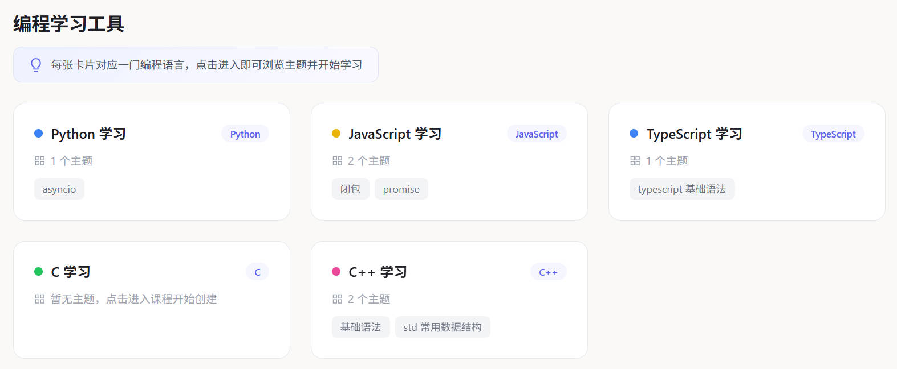
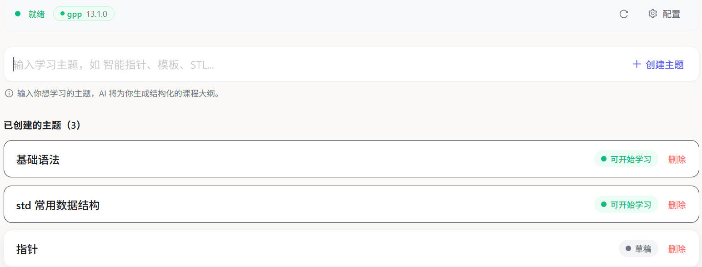
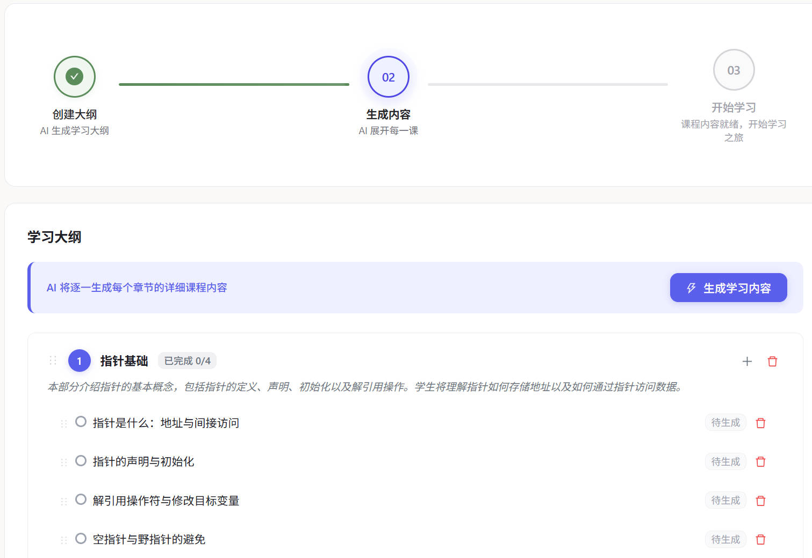
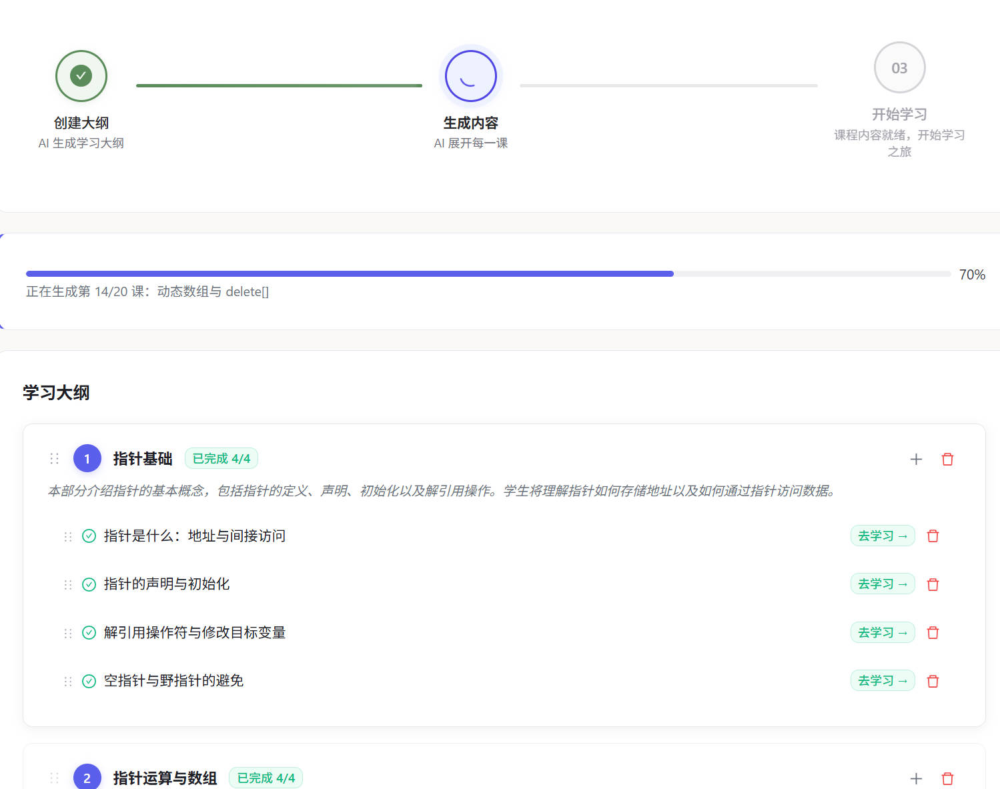
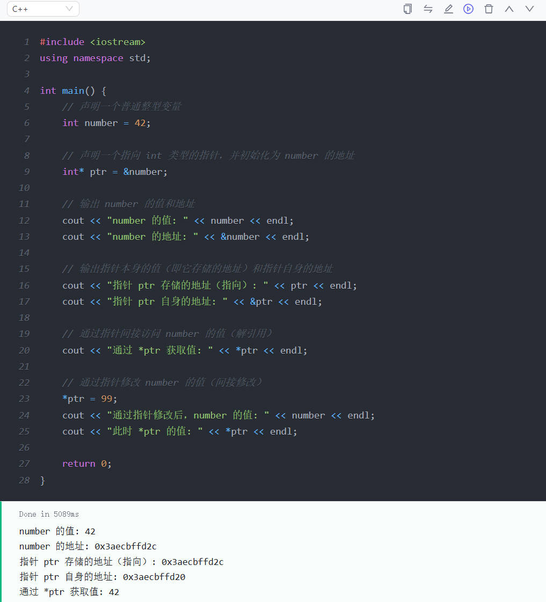
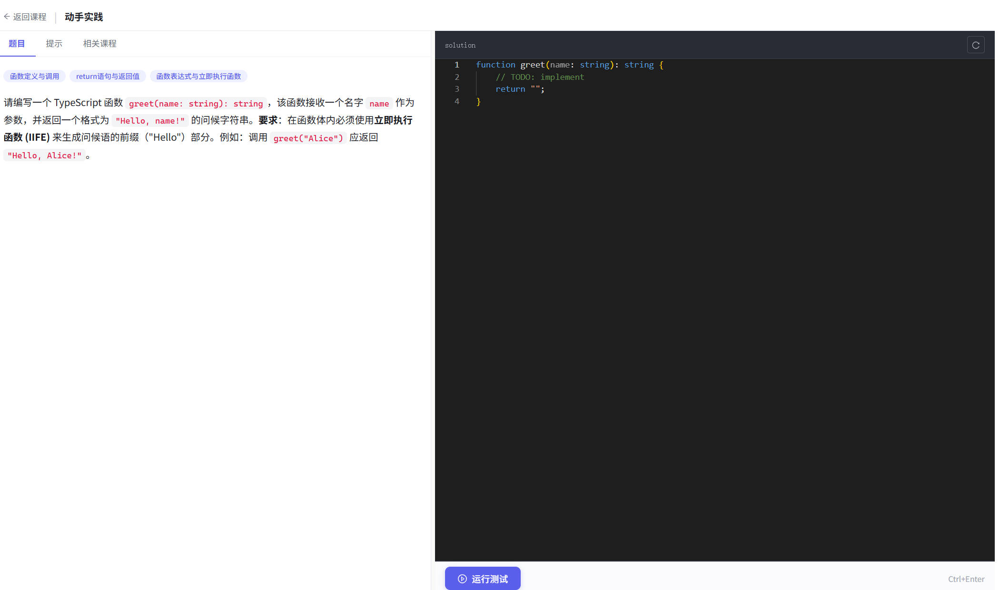
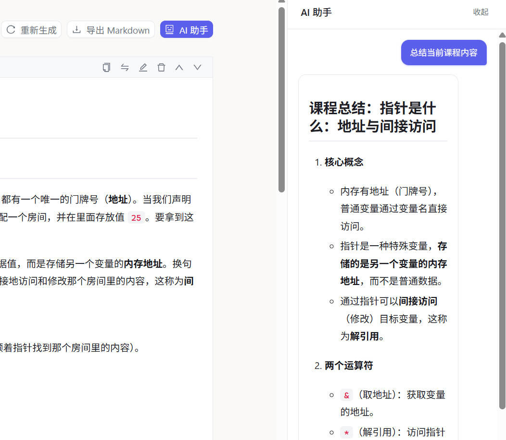

# 编程学习工具 (Learn Coding)

AI 驱动的交互式编程学习平台，支持多种编程语言，提供从大纲生成到在线编码实践的完整学习流程。

## 功能特性

- **多语言支持** — Python、JavaScript、TypeScript、C、C++、Bash，覆盖主流编程语言
- **AI 生成课程** — 输入主题，AI 自动生成结构化学习大纲、章节内容和编程练习
- **AI 生成练习题** — 每个章节自动生成配套编程练习题，支持在线作答和自动判题
- **在线代码运行** — 课程内嵌代码块 + Monaco Editor 代码编辑器，支持在线运行和调试
- **AI 学习助手** — 学习过程中随时向 AI 助手提问，解答疑难
- **Web 搜索增强** — AI 可联网搜索最新文档和资料，提升课程内容准确性和时效性
- **重新生成** — 课程内容、练习题支持一键重新生成，不满意随时刷新
- **课程反馈与更正** — 发现课程错漏可提交反馈，AI 分析后自动更正
- **环境检测与配置** — 自动检测本地运行时环境，提供安装指引和手动配置

## 技术栈

| 层 | 技术 |
|---|---|
| 前端 | React 19 + TypeScript + Ant Design 6 + Vite 8 |
| 后端 | Python 3.10+ / FastAPI + SQLAlchemy + SQLite |
| AI | OpenAI 兼容 API（支持任意 LLM 提供商） |

## 环境要求

- **Python** >= 3.10（需 pip）
- **Node.js** >= 18（需 npm）
- （可选）对应语言的运行时用于代码在线执行：Python 3、Node.js、GCC、G++

## 快速开始

### 一键安装

```bash
# Linux / macOS
chmod +x setup.sh && ./setup.sh

# Windows（CMD 或 PowerShell）
setup.bat
```

安装脚本自动完成：环境检测 → pip 包安装 → 前端构建 → 数据库初始化。后端安装到系统/用户 Python 环境中，无需虚拟环境。

### 启动服务

安装后 `learn-code` 命令已全局可用，直接运行：

```bash
learn-code
```

或使用启动脚本：

```bash
./start.sh    # Linux / macOS
start.bat     # Windows
```

打开浏览器访问 **http://localhost:8000**，前后端一体化服务（后端 API + 前端 SPA）。

常用选项：

```bash
learn-code --port 8080          # 自定义端口
learn-code --reload             # 开发模式，代码变更自动重载
learn-code --no-open            # 不自动打开浏览器
```

### 手动安装

```bash
# 1. 后端（pip 安装到用户目录，含 learn-code 命令）
cd backend
pip install -e .              # Windows（conda 等可写环境）
pip install --user -e .       # Linux / macOS（系统 Python 需 --user）

# 2. 前端（构建静态文件）
cd ../frontend
npm install && npm run build

# 3. 初始化数据库
cd ../backend && python seed.py

# 4. 启动
learn-code
```

### 前端开发模式

开发前端时，可单独启动 Vite 热重载开发服务器：

```bash
cd frontend && npm run dev      # http://localhost:5173
# 后端需单独运行（另一个终端）
learn-code --reload
```

开发模式下前端请求通过 Vite 自动代理到后端。

## 使用指南

### 1. 配置 AI 模型

启动后点击右上角 **设置** 图标，配置 LLM 连接信息：
- API Key
- Base URL（默认 OpenAI 兼容地址）
- Model（模型名称，如 gpt-4o）

支持任意 OpenAI 兼容 API（OpenAI、DeepSeek、通义千问 等）。

### 2. 配置运行时环境

进入课程页面后，点击 **环境** 按钮打开配置向导：
1. **检测** — 自动检测本地已安装的运行时和工具
2. **安装指引** — 对缺失组件提供系统对应的安装命令，支持一键执行
3. **手动配置** — 为非标准路径的运行时指定自定义路径

### 3. 开始学习

1. 在首页选择编程语言卡片进入课程

    

2. 输入学习主题（如 `asyncio`、`指针`、`模板`）

    

3. AI 生成结构化学习大纲，你可以调整章节顺序

    

4. 确认后 AI 逐章生成课程内容（概念讲解 + 可运行代码示例）

    

5. 课程中的代码块可以 **在线运行**，即时查看输出

    

6. 课程学完后可生成配套 **编程练习题**，在 Monaco Editor 中编写代码并提交，系统基于测试用例自动判题

    

7. 遇到问题随时使用右侧 **AI 助手** 提问

    

### 4. 课程管理

- 每个课程支持多个主题，可在课程首页查看和管理
- 课程内容持久化存储，支持编辑和重新生成
- 支持导出 Markdown 格式

## 项目结构

```
learn-coding/
├── backend/                  # FastAPI 后端
│   ├── main.py               # 应用入口
│   ├── config.py             # 全局配置（数据库、路径、超时等）
│   ├── database.py           # 数据库连接与迁移
│   ├── models.py             # 数据模型（Language, Course, Topic, Lesson 等）
│   ├── seed.py               # 初始数据填充
│   ├── requirements.txt      # Python 依赖
│   ├── routers/              # API 路由
│   │   ├── languages.py      # 语言列表
│   │   ├── courses.py        # 课程 CRUD
│   │   ├── topics.py         # 主题 + AI 大纲生成
│   │   ├── sections.py       # 章节管理
│   │   ├── lessons.py        # 课程内容
│   │   ├── exercises.py      # 练习题生成与判题
│   │   ├── code_executor.py  # 在线代码执行（SSE 流式）
│   │   ├── chat.py           # AI 学习助手
│   │   ├── environment.py    # 环境检测与配置
│   │   └── settings.py       # AI/工作区设置
│   ├── services/             # 业务逻辑层
│   │   ├── ai_service.py     # LLM 调用封装
│   │   ├── agent_loop.py     # 多轮工具调用 Agent 循环
│   │   ├── tools.py          # AI 工具（web_search, web_fetch）
│   │   ├── exercise_service.py # 练习题构建与校验
│   │   ├── exercise_schema.py  # 练习题数据模型
│   │   ├── code_runner.py    # 统一代码执行器（课程 + 练习题）
│   │   ├── template_generator.py # 代码模板生成
│   │   ├── assertion_generator.py # 断言生成
│   │   ├── outline_service.py# 大纲生成与内容展开
│   │   └── env_checker.py    # 多组件环境检测
│   ├── test_harnesses/       # 各语言测试脚手架
│   ├── llm/                  # LLM 提供商抽象
│   ├── prompts/              # AI 提示词模板
│   └── tests/                # 后端测试
├── frontend/                 # React 前端
│   ├── src/
│   │   ├── api/client.ts     # API 客户端
│   │   ├── pages/            # 页面组件
│   │   │   ├── HomePage.tsx      # 首页（课程卡片）
│   │   │   ├── CourseHome.tsx    # 课程首页（主题管理）
│   │   │   ├── TopicDetail.tsx   # 主题详情（大纲编辑 + 练习题生成）
│   │   │   ├── QuizPage.tsx      # 练习题页面（Monaco Editor + 判题）
│   │   │   └── LearningView.tsx  # 学习视图（课程内容 + AI 助手）
│   │   ├── components/       # 通用组件
│   │   │   ├── EnvConfigWizard.tsx  # 环境配置向导
│   │   │   ├── NotebookCell.tsx     # 代码/Markdown 单元格
│   │   │   ├── TestRunner.tsx       # 代码编辑器 + 判题结果
│   │   │   ├── ExercisePanel.tsx    # 练习题描述面板
│   │   │   ├── SplitPane.tsx        # 可拖拽分栏面板
│   │   │   ├── StatusProgress.tsx   # 生成进度显示
│   │   │   └── ...
│   │   ├── i18n/translations.ts # 国际化文案（中/英）
│   │   └── context/          # React Context
│   └── package.json
├── data/                     # 运行时数据（自动生成）
├── docs/                     # 设计文档与计划
├── setup.sh                  # Linux/Mac 一键安装
├── setup.bat                 # Windows 一键安装
├── start.sh                  # Linux/Mac 启动脚本
└── start.bat                 # Windows 启动脚本
```

## 配置说明

### 环境变量

| 变量 | 说明 | 默认值 |
|---|---|---|
| `LEARN_CODE_HOME` | 数据存储根目录 | `~/.learn-code`（Linux/Mac）或 `%USERPROFILE%\.learn-code`（Windows） |
| `DATABASE_URL` | 数据库连接串 | `sqlite:///{LEARN_CODE_HOME}/data/learn.db` |

数据目录结构：
```
~/.learn-code/
├── data/
│   └── learn.db        # SQLite 数据库
├── workspace/           # 代码执行工作区
└── app.log              # 应用日志（按日轮转）
```

### AI 模型配置

AI 模型设置通过前端界面配置（存储在数据库中），不与具体语言绑定：
- 点击右上角齿轮图标
- 填写 API Key、Base URL、Model
- 支持任意 OpenAI 兼容接口

## License

MIT
